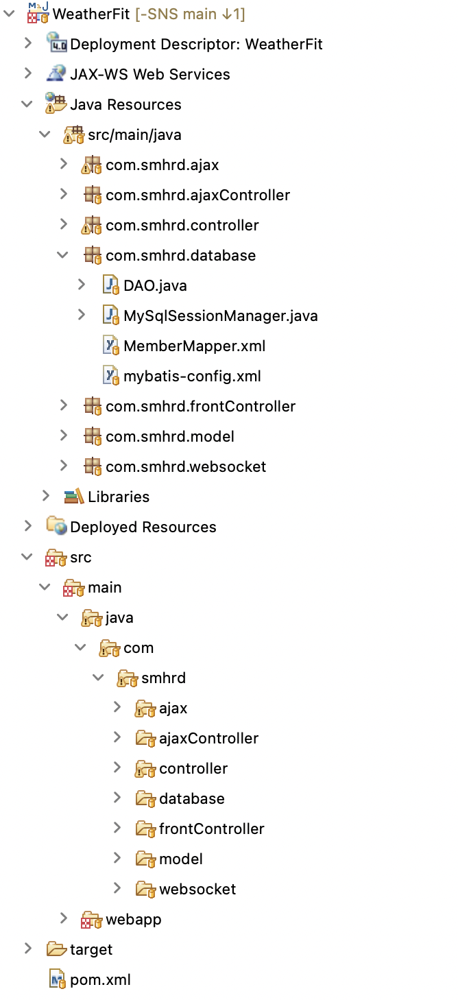
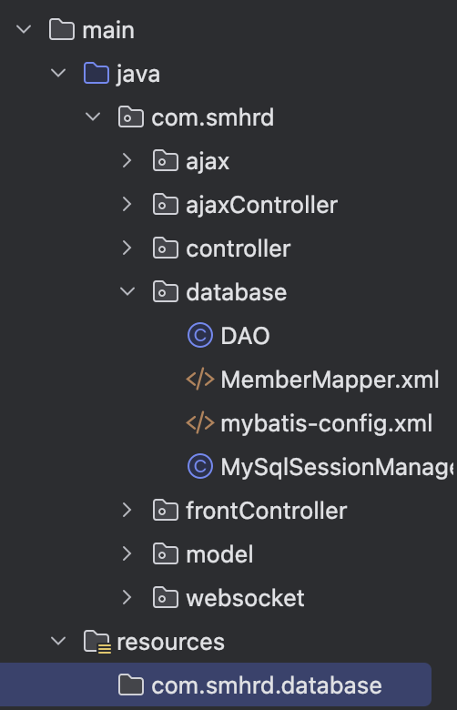
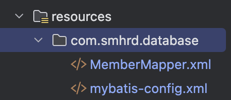
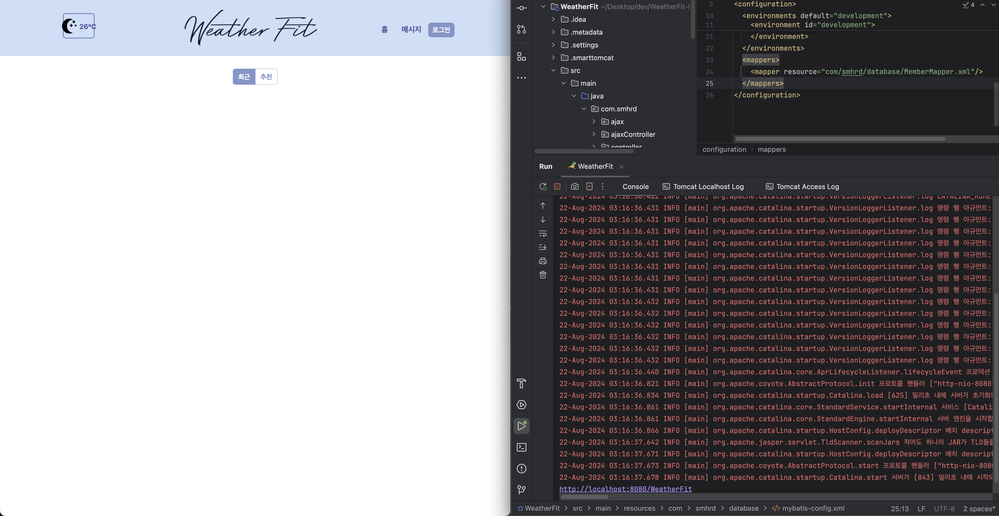

## 개요
몇 달 전 국비교육에서 진행한 WeatherFit 프로젝트를 어제 인텔리제이에서 실행하는 데 성공했다!

하지만, 실행했더니 브라우저에 초기 화면은 잘나오지만 인텔리제이 콘솔에 오류가 났다.


com/smhrd/database/mybatis-config.xml 경로의 리소스를 찾을 수 없다고 한다..

- mybatis-config.xml
```xml
<?xml version="1.0" encoding="UTF-8" ?>
<!DOCTYPE configuration
  PUBLIC "-//mybatis.org//DTD Config 3.0//EN"
  "https://mybatis.org/dtd/mybatis-3-config.dtd">
<configuration>
  <typeAliases>
    <typeAlias type="com.smhrd.model.UserVO" alias="uvo"/>
    <typeAlias type="com.smhrd.model.PostVO" alias="pvo"/>
  </typeAliases>
  <environments default="development">
    <environment id="development">
      <transactionManager type="JDBC"/>
      
      <dataSource type="POOLED">
        <property name="driver" value="com.mysql.cj.jdbc.Driver"/>
        <property name="url" value="jdbc:mysql://localhost:3306/{NAME}"/>
        <property name="username" value="{USERNAME}"/>
        <property name="password" value="{PASSWORD}"/>
      </dataSource>
      
    </environment>
  </environments>
  <mappers>
    <mapper resource="com/smhrd/database/MemberMapper.xml"/>
  </mappers>
</configuration>
```

## 원인

mybatis-config.xml 파일이 이클립스에서는 실행되던 것이 인텔리제이에서 실행이 안된 것은 이클립스와 인텔리제이의 프로젝트 폴더 구조가 다르기 때문이다.

> 먼저 알아두어야 할 것은 mybatis-config.xml과 같은 설정 파일은 프로젝트에서 resource이다.

- 이클립스 Dynamic Web Project 폴더 구조


이미지를 보면 이클립스에서는 Java Resources 폴더 아래 src/main/java 폴더가 있고, 또 다른 src/main/java 폴더가 있다. 즉, src/main/java가 두 개가 있다.

- 인텔리제이로 변환한 폴더 구조


반면 인텔리제이에서 src/main/java 폴더가 한 개가 있다.
> 생각해보니 인텔리제이의 프로젝트에는 항상 resources 폴더가 있었다!

이클립스는 resource를 Classpath로 자동 설정해주기 위해 src/main/java 폴더가 두 개가 있던 것이고, 인텔리제이에서는 따로 설정해주어야 한다는 사실을 알았다.

## 해결 방안
내가 시도한 방법은 3가지가 있다.

1. mybatis-config.xml 파일을 WEB-INF/config 폴더 하위로 이동하고 경로 수정하기
2. 파일 경로를 ServletContext를 통해 가져와서 Resources가 아닌 FileInputStream으로 인식하게 해서 Servlet에 mybatis-config.xml파일 등록하기
3. 인텔리제이에서 resources 폴더를 생성하고 이 폴더를 resources 폴더라고 인식하게 설정하기

나는 3번 방안으로 해결했는데, 비교적 간단하고 가장 맞는 방법인 것 같다.

## 과정

먼저 main 폴더 하위에 resources 폴더를 만든다.
> 인텔리제이가 자동으로 resources 폴더를 잡아주길래 놀랬다. 폴더 아이콘을 보면 일반 폴더랑 다른 것을 볼 수 있다. 이것은 뒤에서 설명하겠다.


resources 폴더 아래에 원래 mybatis-config.xml 파일이 있던 경로 그대로 하위 폴더(com.smhrd.database)를 생성한다.


Mapper.xml 파일과 mybatis-config.xml 파일을 하위로 이동한다.


실행해서 확인하면 더 이상 오류가 안나오는 것을 확인할 수 있다.